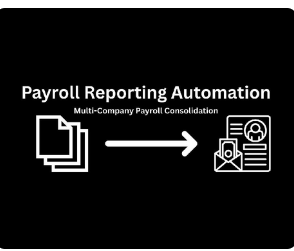
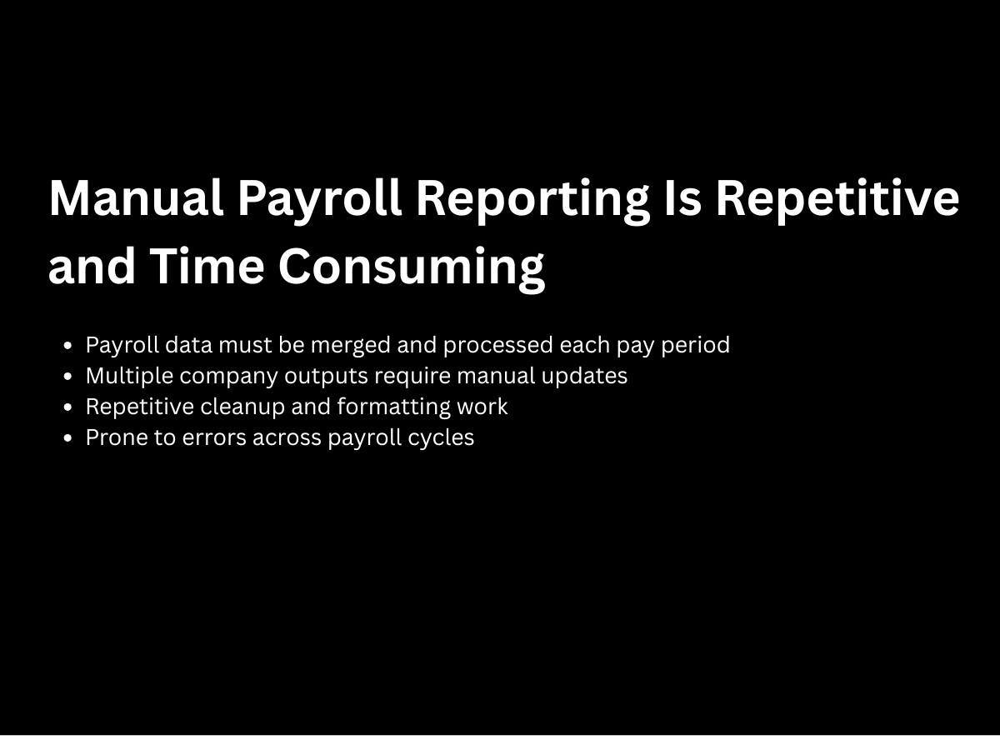
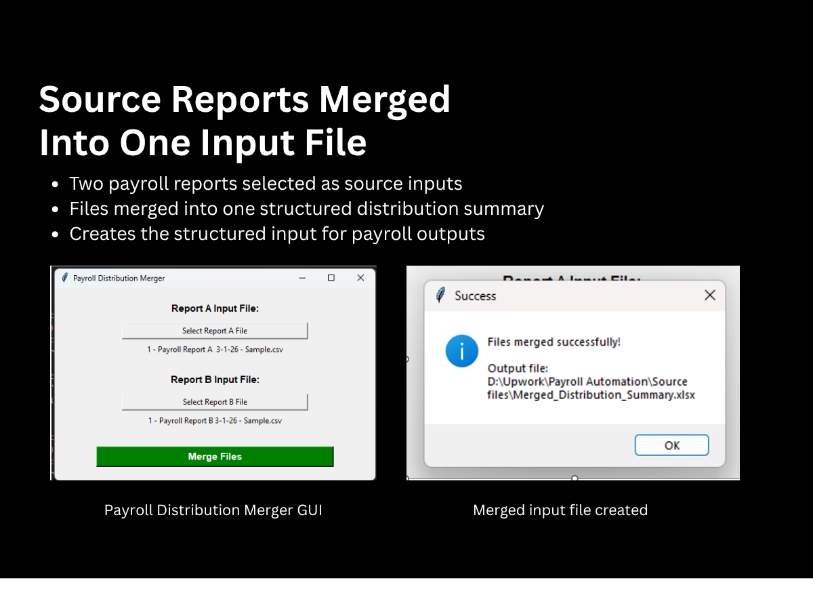
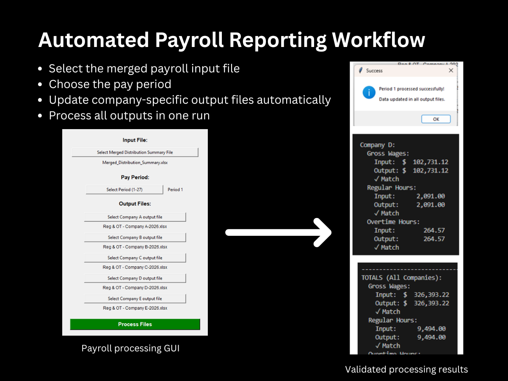
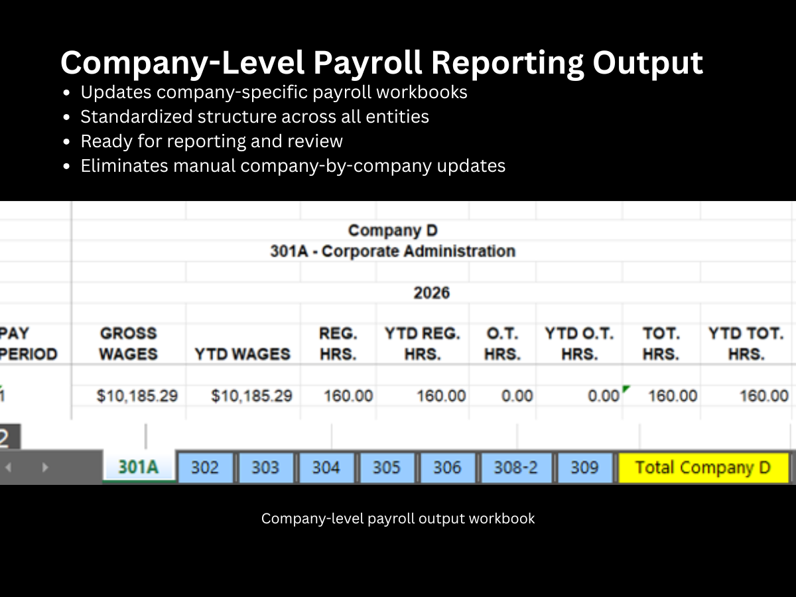
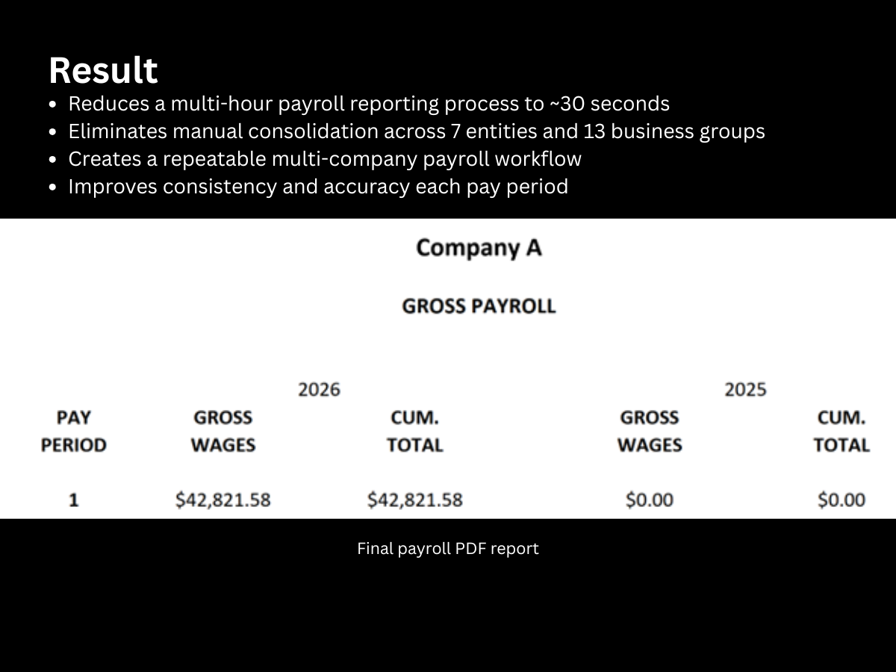

# Automated Payroll Reporting



> ## Portfolio Case Study
>
> This repository documents a finance automation project developed in a previous professional role.
>
> The original implementation contained proprietary code and business logic that cannot be shared publicly. This repository focuses on the workflow, architecture, business value, and technical approach while respecting employer confidentiality.

---

# Overview

This project documents an end-to-end payroll reporting automation built with Python and Microsoft Excel.

The automation merges payroll source reports, validates payroll totals, updates company-specific reporting workbooks, and generates standardized payroll reports across multiple legal entities and business groups.

The solution transformed a repetitive, multi-hour payroll reporting process into an automated workflow capable of completing the same work in approximately **30 seconds** while improving reporting consistency, accuracy, and validation.

---

# Project Summary

| Category                 | Details                                                    |
| ------------------------ | ---------------------------------------------------------- |
| **Industry**             | Accounting / Finance                                       |
| **Business Function**    | Payroll Reporting                                          |
| **Project Type**         | Workflow Automation                                        |
| **Primary Technologies** | Python, Microsoft Excel, Tkinter                           |
| **Key Outcome**          | Automated payroll reporting across multiple legal entities |
| **Repository Type**      | Portfolio Case Study                                       |
| **Source Code**          | Not included due to employer confidentiality               |

---

# Business Impact

This automation transformed a repetitive payroll reporting workflow into a standardized, repeatable process that significantly reduced manual effort while improving reporting accuracy and consistency.

## Key Results

* Reduced processing time from multiple hours to approximately **30 seconds**
* Eliminated manual consolidation across **7 legal entities**
* Automated reporting across **13 business groups**
* Reduced repetitive manual data entry
* Improved reporting consistency
* Increased confidence through automated validation
* Created a repeatable payroll reporting workflow
* Allowed finance staff to focus more on analysis rather than report preparation

---

# Business Problem

Payroll reporting was performed manually every pay period.

The existing workflow required:

* Combining multiple payroll exports
* Cleaning and standardizing payroll data
* Updating individual company reporting workbooks
* Producing consolidated payroll reports
* Validating totals between source files and final reports

Because each company required separate workbook updates, the process was repetitive, time-consuming, and susceptible to manual errors.

Beyond the time investment, the manual process introduced opportunities for inconsistent reporting and increased the effort required to verify payroll accuracy before reports could be distributed.

---

# Solution

I designed and developed a Python-based automation that performs the complete payroll reporting workflow from beginning to end.

The solution:

* Merges multiple payroll source reports
* Creates a standardized payroll dataset
* Updates company-specific reporting workbooks
* Automatically validates payroll totals
* Produces standardized reporting outputs
* Generates repeatable reports with minimal user interaction

The application provides a simple graphical interface allowing users to select payroll files, choose the payroll period, and process every company simultaneously.

---

# Solution Architecture

```text
Payroll Reports

        │
        ▼

Merge Source Files

        │
        ▼

Standardize Payroll Data

        │
        ▼

Validate Totals

        │
        ▼

Update Company Workbooks

        │
        ▼

Generate Final Reports
```

---

# Project Gallery

## 1. Manual Payroll Reporting Process



The original workflow required multiple manual steps every payroll cycle, including merging payroll files, updating numerous company workbooks, formatting reports, and validating totals.

---

## 2. Payroll Source File Merger



Multiple payroll exports are automatically merged into a standardized dataset, eliminating manual consolidation before reporting begins.

---

## 3. Payroll Processing Application



Simple desktop application allowing users to:

* Select payroll source files
* Choose the payroll period
* Process all company workbooks
* Automatically validate results

---

## 4. Company-Level Reporting Output



Automatically updated payroll workbook with standardized formatting and current payroll information.

The automation eliminates repetitive workbook updates across multiple legal entities.

---

## 5. Final Payroll Reports



Generated payroll reports ready for management review.

The workflow produces consistent, repeatable reporting outputs every payroll cycle.

---

# Technologies Used

* Python
* Microsoft Excel
* Tkinter
* Financial Reporting Automation
* Workflow Automation
* Data Validation
* Data Processing
* Desktop Application Development
* Process Automation

---

# Skills Demonstrated

## Programming

* Python

## Desktop Development

* Tkinter GUI Development

## Data Engineering

* Data Validation
* Data Transformation
* Payroll Data Processing

## Financial Systems

* Payroll Reporting
* Multi-Entity Reporting
* Excel Automation

## Automation

* Workflow Automation
* Business Process Improvement
* Report Standardization

---

# Technical Challenges

Several technical and business challenges were addressed while developing this workflow.

* Consolidating multiple payroll exports into a standardized dataset.
* Supporting reporting across seven legal entities and thirteen business groups.
* Maintaining consistent workbook structures across numerous reporting files.
* Validating payroll totals before generating reports.
* Designing a workflow that minimized user interaction while preserving reporting accuracy.
* Creating repeatable reporting outputs regardless of who executed the process.

---

# Key Design Decisions & Lessons Learned

Developing this project reinforced several important principles of finance automation.

## Standardize Data Early

One of the biggest improvements came from creating a standardized payroll dataset before generating reports. By normalizing data at the beginning of the workflow, every downstream process became simpler, more reliable, and easier to maintain.

## Validate Before Producing Output

Financial reporting requires accuracy. Automated validation comparing input totals to generated outputs increased confidence in the reporting process while reducing manual verification.

## Automate Entire Workflows

Rather than automating isolated spreadsheet updates, this project automated the complete reporting workflow—from merging payroll files through final report generation. Automating the entire process produced significantly greater efficiency gains than automating individual tasks.

## Design for Non-Technical Users

The application was intentionally built with a simple graphical interface so accounting staff could operate the automation without interacting directly with Python code.

## Build for Repeatability

Payroll reporting occurs every pay period. Creating a consistent, repeatable workflow proved more valuable than simply making the process faster.

---

# Future Enhancements

If I were continuing development today, I would prioritize:

* Storing configuration settings instead of requiring manual file selection.
* Adding detailed logging and audit trails.
* Creating automated exception reports for validation failures.
* Supporting configurable reporting templates.
* Packaging the application as a standalone executable with automatic updates.
* Integrating directly with payroll or ERP APIs instead of relying on exported files.
* Deploying the solution as an internal web application or service for centralized processing.

---

# Privacy Note

This repository is presented as an anonymized portfolio case study.

Vendor names, company information, payroll structures, reporting logic, source code, and proprietary business rules have been removed or replaced to respect employer confidentiality.

---

# Project Status

This repository is an engineering case study documenting a production payroll reporting automation developed in a previous professional role.

The original implementation cannot be shared publicly because it contains proprietary payroll structures, employer-owned source code, and confidential reporting logic.

The repository focuses on documenting the solution architecture, workflow design, business impact, and technical approach while respecting confidentiality obligations.

---

# Professional Context

This project reflects my approach to finance automation: first understand the reporting workflow, then standardize the underlying data, automate repetitive tasks, validate financial outputs, and deliver reliable reporting that allows finance professionals to spend more time analyzing information instead of preparing it.
